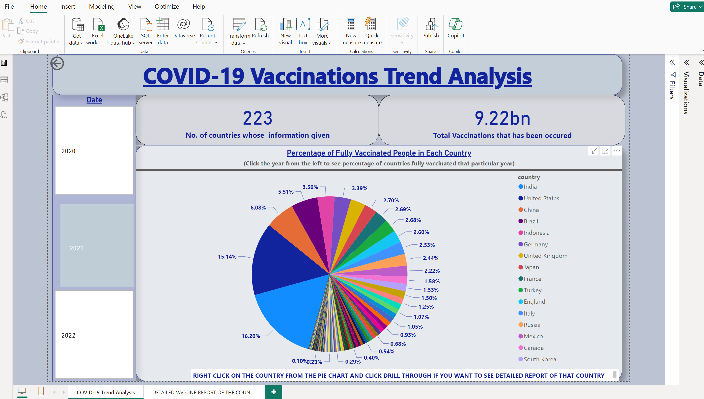
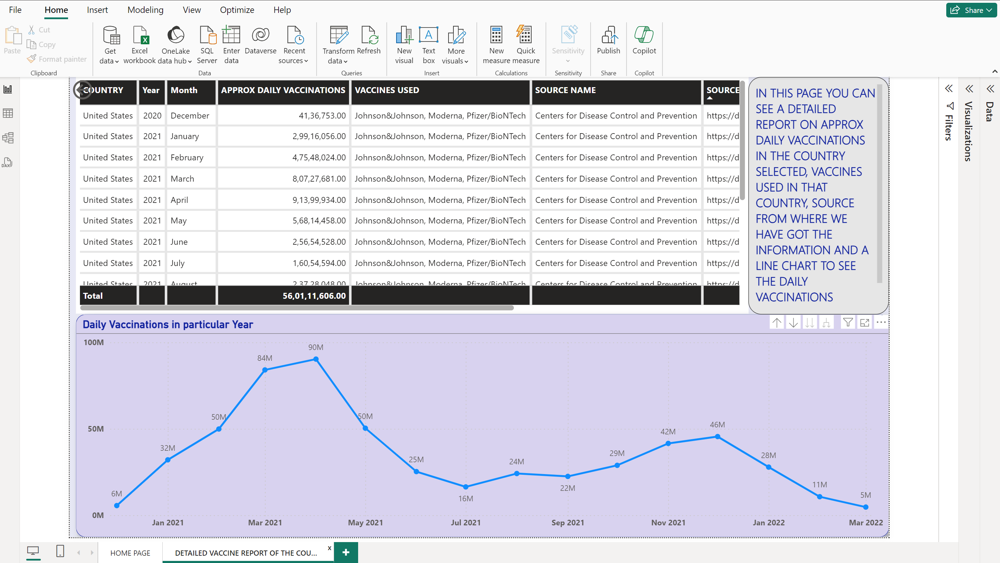

# COVID-19 Vaccination Analysis using Power BI

## Introduction

Welcome to the COVID-19 Vaccination Analysis project! This Power BI dashboard aims to provide comprehensive insights into the global COVID-19 vaccination efforts. The dashboard offers visualizations and data analysis on various aspects of vaccination, including distribution, progress, and trends.

## Data Sources

The data used in this project is sourced from reliable and reputable sources such as:

- World Health Organization (WHO)
- Centers for Disease Control and Prevention (CDC)
- Our World in Data
- Government health departments of various countries

## Features

### 1. Overview Dashboard

The Overview Dashboard provides a snapshot of key vaccination metrics globally . It includes:

- Total doses administered
- Vaccination coverage
- Vaccination progress over time
- Top countries by vaccination rate

### 2. Country-wise Analysis

The Country-wise Analysis dashboard allows users to delve into vaccination data for specific countries. Key features include:

- Vaccination progress by date
- Breakdown of vaccine types administered
- Comparison with neighboring countries
### ANALYSIS
-First, we created a slicer to distinguish the whole information year wise, by creating a date hierarchy. Through this we can analyse how many countries have started the vaccination process in 2020, 2021 and 2022. Through this we get to know that vaccination process started in 2020 from two counties USA and Germany which started worldwide from 2021.
-Then just to summarize at the start of the report I created two face cards to tell how many countries information is recorded in the report and how many vaccinations have been occurred in these years is summarized.
-Then I created a pie chart to tell the countries that has been vaccinated in that year and its percentage of vaccinations. In the pie chart below I have told the information about the year 2021. 
-In next page I created a table to see vaccines used in each country, source from where we have got the information and a line chart to see the daily vaccinations getting in each country.
-I created a drill through page 1 that is named as “Home Page” to another page which I renamed as “Detailed Report of the country” by adding countries in the field so that whenever we right click in any country in pie chart, we get the table and line chart of that country and year selected from the slicer.
-In this page you can see a detailed report on approx. daily vaccinations in the country selected, vaccines used in the country USA, source from where we have got the information and a line chart to see the daily vaccinations getting in that country in the year 2021 as selected.

### INSIGHTS
-Our COVID-19 trend analysis, enriched with visualizations such as pie charts and detailed reports, has yielded profound insights into the dynamics of the pandemic. One key insight gleaned from our analysis is the disproportionate impact of COVID-19 across different demographic groups. Through pie charts depicting the distribution of vaccines used in different countries, we uncovered that country with more populations tend to experience higher rates of severe illness and mortality, emphasizing the urgency of prioritizing vaccination efforts and protective measures for vulnerable groups to country like USA.
-Moreover, our analysis revealed the evolving nature of the pandemic, with trends in case counts, positivity rates, and vaccination coverage fluctuating over time. By synthesizing these trends into actionable insights, our analysis provides stakeholders with valuable information to guide decision-making and policy formulation, ultimately contributing to more effective pandemic response efforts.

## Contact Information

For inquiries or support regarding this project, please contact Arsh Zehra at zehrarsh@gmail.com.

